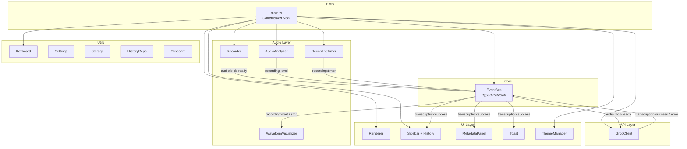
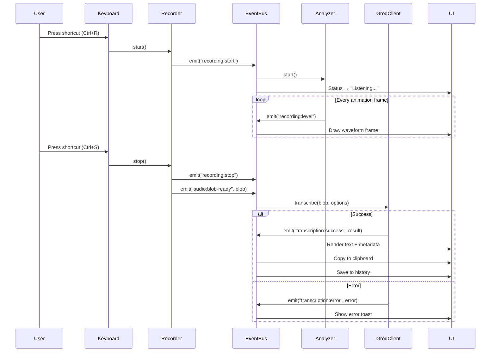

<div align="center">
  

  <h1>LU YUME — Speech-to-Text</h1>

  <p>
    Browser-based speech-to-text transcription powered by
    <strong>Groq Whisper</strong>. Record your voice, get instant text —
    no backend, no server, runs entirely in the browser.
  </p>

  <p>
    
    
    
    
  </p>

  
</div>

---

## Table of Contents

- [Features](#features)
- [Architecture](#architecture)
- [Tech Stack](#tech-stack)
- [Getting Started](#getting-started)
- [Project Structure](#project-structure)
- [Module Overview](#module-overview)
- [Keyboard Shortcuts](#keyboard-shortcuts)
- [Environment Variables](#environment-variables)
- [Scripts](#scripts)
- [License](#license)

---

## Features

- **Real-time transcription** — Record audio from the microphone and send it to Groq Whisper for instant speech-to-text conversion.
- **Translation mode** — Switch between transcription (same language) and translation (to English) with a single dropdown.
- **Waveform visualization** — Live audio waveform rendered on a `<canvas>` element during recording.
- **Silence detection** — Automatically stops recording after a configurable silence threshold.
- **Transcription history** — Persistent sidebar with full CRUD: restore past transcriptions, delete individual entries, or clear all history. Data survives page reloads via `localStorage`.
- **Metadata panel** — When using `verbose_json` format, displays detected language, confidence, segment timestamps, and duration.
- **Output toolbar** — Copy to clipboard, clear text, or download as `.txt`.
- **Dark / Light theme** — Toggle between themes with system preference detection. Choice persists across sessions.
- **Keyboard shortcuts** — OS-aware shortcuts (Cmd on macOS, Ctrl elsewhere) for record start/stop.
- **Responsive design** — Works on desktop and mobile viewports.
- **No backend required** — All logic runs client-side. The only external call is to the Groq API.

---

## Architecture

The application follows a **modular event-driven architecture** built around a typed `EventBus`. No module imports another module directly — they communicate exclusively through events, adhering to the **Dependency Inversion Principle**.



### Data Flow



---

## Tech Stack

| Layer            | Technology                 | Purpose                                        |
| ---------------- | -------------------------- | ---------------------------------------------- |
| Language         | TypeScript 5.x             | Type-safe development                          |
| Build tool       | Vite 6.x                   | Fast dev server and optimized production build |
| Styling          | Tailwind CSS 4.x           | Utility-first CSS with design system tokens    |
| Linting          | ESLint + typescript-eslint | Static analysis and code quality               |
| Formatting       | Prettier                   | Consistent code style                          |
| Pre-commit hooks | Husky + lint-staged        | Run lint/format on staged files before commit  |
| API              | Groq Whisper API           | Speech-to-text / translation                   |
| Storage          | localStorage               | Persistent history and user preferences        |
| Audio            | MediaRecorder + Web Audio  | Microphone capture and real-time analysis      |

---

## Getting Started

### Prerequisites

- **Node.js** ≥ 18
- **npm** (comes with Node.js)
- A **Groq API key** — get one at [console.groq.com](https://console.groq.com)

### Installation

```bash
# Clone the repository
git clone https://github.com/<your-username>/speech-to-text.git
cd speech-to-text

# Install dependencies
npm install

# Create your environment file
cp .env.example .env
```

Edit `.env` and add your Groq API key:

```env
VITE_GROQ_API_KEY=your_groq_api_key_here
```

### Development

```bash
npm run dev
```

Open [http://localhost:5173](http://localhost:5173) in your browser. Grant microphone access when prompted.

### Production Build

```bash
npm run build
```

Output goes to `dist/`. Serve it with any static file server.

### Preview Production Build

```bash
npm run preview
```

---

## Project Structure

```
speech-to-text/
├── public/
│   ├── favicon.svg            # LU YUME brand icon
│   └── icons.svg              # Shared SVG sprite
├── src/
│   ├── api/
│   │   └── groq-client.ts     # Groq Whisper API client
│   ├── audio/
│   │   ├── audio-analyzer.ts  # Web Audio API real-time analyzer
│   │   ├── recorder.ts        # MediaRecorder wrapper
│   │   ├── recording-timer.ts # Elapsed time tracker
│   │   └── waveform-visualizer.ts # Canvas waveform renderer
│   ├── core/
│   │   └── event-bus.ts       # Typed pub/sub event system
│   ├── ui/
│   │   ├── history-card.ts    # Single history entry renderer
│   │   ├── metadata-panel.ts  # Verbose JSON metadata display
│   │   ├── renderer.ts        # Full app DOM layout builder
│   │   ├── sidebar.ts         # Floating history panel
│   │   └── toast.ts           # Non-blocking notification toasts
│   ├── utils/
│   │   ├── clipboard.ts       # Clipboard API wrapper
│   │   ├── history-repo.ts    # CRUD over localStorage history
│   │   ├── keyboard.ts        # Global shortcut manager
│   │   ├── os-detect.ts       # Platform detection (macOS vs other)
│   │   ├── settings.ts        # Reads UI state into typed config
│   │   ├── storage.ts         # Type-safe localStorage wrapper
│   │   ├── theme.ts           # Light/dark theme manager
│   │   └── time-ago.ts        # Relative time formatter (Spanish)
│   ├── main.ts                # Composition root / entry point
│   ├── style.css              # Design system tokens + Tailwind
│   └── types.ts               # Shared type definitions
├── index.html                 # SPA shell
├── vite.config.ts             # Vite configuration
├── eslint.config.js           # ESLint flat config
├── package.json
└── tsconfig.json
```

---

## Module Overview

### Core

| Module         | Responsibility                                                                                                        |
| -------------- | --------------------------------------------------------------------------------------------------------------------- |
| `event-bus.ts` | Typed publish/subscribe system. The backbone of the architecture — all inter-module communication flows through this. |

### Audio

| Module                   | Responsibility                                                                                                                                        |
| ------------------------ | ----------------------------------------------------------------------------------------------------------------------------------------------------- |
| `recorder.ts`            | Wraps the browser `MediaRecorder` API. Manages microphone access, start/stop lifecycle, and emits `audio:blob-ready` events with the recorded `Blob`. |
| `audio-analyzer.ts`      | Connects to a `MediaStream` via the Web Audio API. Provides real-time volume levels and waveform data for the visualizer. Includes silence detection. |
| `recording-timer.ts`     | Tracks elapsed recording time. Emits periodic `recording:timer` ticks so the UI can display a running clock.                                          |
| `waveform-visualizer.ts` | Draws a real-time audio waveform on an HTML `<canvas>`. Reads byte time-domain data from the analyzer.                                                |

### API

| Module           | Responsibility                                                                                                                                                                      |
| ---------------- | ----------------------------------------------------------------------------------------------------------------------------------------------------------------------------------- |
| `groq-client.ts` | Handles HTTP communication with the Groq Whisper API. Supports both `/transcriptions` and `/translations` endpoints. Emits `transcription:success` or `transcription:error` events. |

### UI

| Module              | Responsibility                                                                                                                                                        |
| ------------------- | --------------------------------------------------------------------------------------------------------------------------------------------------------------------- |
| `renderer.ts`       | Builds the complete DOM layout using design system tokens. Returns typed element references (`AppElements`) for programmatic access.                                  |
| `sidebar.ts`        | Floating collapsible panel with transcription history. Provides entry population, prepend, removal, and clear operations.                                             |
| `history-card.ts`   | Renders a single transcription entry in the sidebar. Handles copy, restore, and delete actions per card.                                                              |
| `metadata-panel.ts` | Displays enriched transcription details from `verbose_json` responses: detected language, confidence, segments, and duration.                                         |
| `toast.ts`          | Non-blocking notification system. Renders brief messages in the bottom-right corner with auto-dismiss and type-based styling (`success`, `error`, `warning`, `info`). |

### Utils

| Module            | Responsibility                                                                                                                      |
| ----------------- | ----------------------------------------------------------------------------------------------------------------------------------- |
| `storage.ts`      | Type-safe `localStorage` wrapper with JSON serialization and error handling.                                                        |
| `history-repo.ts` | CRUD operations over a bounded list of `HistoryEntry` objects stored in `localStorage`. Enforces a maximum entry count.             |
| `settings.ts`     | Reads current UI control values (model, language, temperature, format, etc.) into typed `TranscriptionOptions` objects.             |
| `keyboard.ts`     | Registers global keyboard shortcuts with OS-aware modifier key detection (Cmd on macOS, Ctrl elsewhere).                            |
| `clipboard.ts`    | Wraps the Clipboard API with graceful error handling and a boolean return for success/failure.                                      |
| `theme.ts`        | Manages light/dark/system theme. Persists choice to `localStorage`. Applies a `dark` class on `<html>` and toggles icon visibility. |
| `os-detect.ts`    | Detects the user's platform from the user agent string and returns the correct modifier key label.                                  |
| `time-ago.ts`     | Converts Unix timestamps to human-readable relative time strings in Spanish ("ahora", "hace 5 min", "hace 2 horas").                |

---

## Keyboard Shortcuts

| Action          | macOS       | Linux / Windows |
| --------------- | ----------- | --------------- |
| Start recording | `Cmd` + `R` | `Ctrl` + `R`    |
| Stop recording  | `Cmd` + `S` | `Ctrl` + `S`    |

Shortcuts adapt to the selected recording mode:

- **Toggle mode** — Shortcut starts recording; press again to stop.
- **Push-to-talk mode** — Hold shortcut to record; release to stop.

---

## Environment Variables

| Variable            | Required | Description                                                                                            |
| ------------------- | -------- | ------------------------------------------------------------------------------------------------------ |
| `VITE_GROQ_API_KEY` | Yes      | Your Groq API key for Whisper transcription. Obtain from [console.groq.com](https://console.groq.com). |

Create a `.env` file in the project root (it is gitignored):

```env
VITE_GROQ_API_KEY=gsk_xxxxxxxxxxxxxxxx
```

---

## Scripts

| Command           | Description                                                    |
| ----------------- | -------------------------------------------------------------- |
| `npm run dev`     | Start the Vite development server with hot module replacement. |
| `npm run build`   | Type-check and build for production. Output in `dist/`.        |
| `npm run preview` | Preview the production build locally.                          |
| `npm run lint`    | Run ESLint across the project.                                 |
| `npm run format`  | Format all files with Prettier.                                |

---

## License

This project is licensed under the **MIT License**. See the [LICENSE](LICENSE) file for details.
